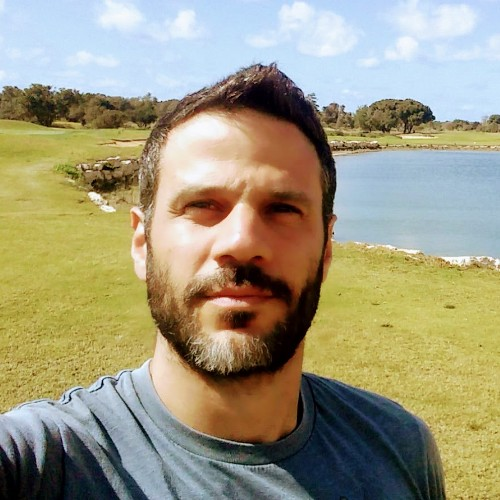

    

        
    

    

        <h1>Gilad Kutiel</h1>
        <ul>
            <li>gilad.kutiel@gmail.com</li>
        </ul>
    

## Education
### PhD in Computer Science, GPA: 92.8
#### Technion, Israel, Oct 2014 - Apr 2019   
lala baba gaga
- Thesis: Approximation Algorithms for Submodular Maximization and Network Design Problems.

## Professional Experience
### Machine Learning Researcher  
#### [Organization Name], [Start Date – End Date or Present]  
- Conducted research on [specific topics, e.g., deep learning, NLP, reinforcement learning].  
- Published [number] papers in top-tier conferences, including [e.g., NeurIPS, CVPR].  
- Developed [specific algorithms/models/tools] to [describe impact, e.g., improve prediction accuracy by X%].

## Publications
1. **[Paper Title]** – [Conference/Journal Name], [Year].  
   Summary: [One-line description of the paper's focus and significance].

## Side Projects
